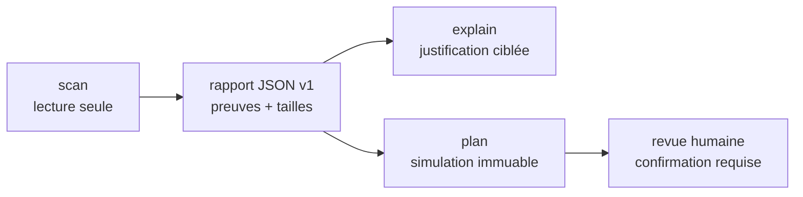

<div align="center">

# ◆ dev-audit

### Comprendre ce qui occupe votre Mac de développement — avant de nettoyer.

[](https://www.apple.com/macos/)
[](https://go.dev/)
[](#état-du-projet)
[](#sécurité-par-conception)
[](#du-scan-au-plan)

`dev-audit` cartographie les projets, les toolchains et les caches de développement,
puis explique ce qui est utilisé, reconstructible, sensible ou simplement inconnu.

</div>

---

## Pourquoi dev-audit ?

Un Mac de développement accumule vite plusieurs SDK Flutter, versions de
Gradle, images Android, JDK, caches Docker, DerivedData et simulateurs iOS.
Supprimer le plus gros dossier n'est pourtant pas une stratégie sûre : une
ressource volumineuse peut encore être indispensable à un projet oublié.

`dev-audit` adopte une approche fondée sur les preuves :

- il découvre les projets et installations dans les emplacements standards ;
- il extrait statiquement les versions réellement déclarées ;
- il sépare les dépendances de l'hôte, de Docker et du daemon Docker local ;
- il relie chaque conclusion à sa source et à un niveau de confiance ;
- il prépare des actions ciblées sans jamais les exécuter automatiquement.

> [!IMPORTANT]
> `dev-audit scan` est en lecture seule et `dev-audit plan` produit uniquement
> une simulation. La version actuelle ne possède aucune commande `apply`,
> `execute` ou suppression automatique.

## Démarrage rapide

### 1. Installer Go

Le build depuis les sources nécessite Go 1.27. Sur macOS avec Homebrew :

```bash
brew install go
go version
```

### 2. Installer la commande

```bash
git clone https://github.com/Bertheam/dev-audit-cli.git
cd dev-audit-cli
./scripts/install.sh
dev-audit version
```

L'installateur choisit `/opt/homebrew/bin`, `/usr/local/bin` ou
`~/.local/bin` selon la machine. Aucun `go run` n'est nécessaire ensuite.

### 3. Auditer le Mac

```bash
dev-audit scan
```

Sans configuration, la CLI recherche les projets et toolchains dans le `PATH`,
les emplacements macOS usuels et les dossiers de développement courants. La
recherche profonde reste bornée et ne suit pas les symlinks externes.

Pendant une exécution interactive, une progression discrète indique l'étape
réelle en cours et le temps écoulé : auto-détection, analyse des projets,
inventaires, Docker, corrélation puis classification. Elle est écrite sur
`stderr` et ne peut donc pas corrompre un rapport JSON envoyé sur `stdout`.

## Ce que la CLI comprend

| Famille | Projets et exigences | Ressources locales |
|---|---|---|
| Flutter / Dart | `pubspec.yaml`, FVM, contrainte Dart | SDK Flutter directs, cache FVM, Dart embarqué |
| Android | SDK/NDK/CMake, AGP, Kotlin, Gradle Wrapper | plateformes, Build Tools, NDK, CMake, images système, AVD |
| Java | compatibilité et toolchain Gradle | JDK standards, Homebrew, IDE et gestionnaires usuels |
| Docker | `Dockerfile`, Compose, images et toolchains déclarées | images, conteneurs, builders et cache BuildKit |
| Apple | présence des projets et artefacts iOS | Xcode, DerivedData, Device Support, runtimes et simulateurs |

Les relations positives apparaissent dans des environnements distincts :

- `HOST` : installation réellement inventoriée sur le Mac ;
- `DOCKER` : toolchain ou image déclarée statiquement dans le projet ;
- `DOCKER_DAEMON` : image observée dans le daemon Docker courant.

## Du scan au plan



### Exporter un rapport vérifiable

```bash
dev-audit scan --format json --output audit.json
```

Le rapport contient les projets, exigences, ressources, relations,
classifications et diagnostics. Son schéma JSON v1 est embarqué dans le binaire.

### Comprendre une observation

```bash
dev-audit explain --report audit.json resource-0123456789abcdef
```

`explain` restitue les fichiers, clés, lignes et règles qui justifient le statut
d'une ressource ou d'une exigence.

### Créer un plan conservateur

```bash
dev-audit plan \
  --report audit.json \
  --format json \
  --output cleanup-plan.json
```

Le mode automatique ne retient que les ressources prouvées
`ORPHELINE_PROBABLE`, reconstructibles et accompagnées d'une estimation
conservatrice. Un plan vide est donc un résultat normal et sûr.

### Examiner une sélection précise

```bash
dev-audit plan \
  --report audit.json \
  --resource resource-0123456789abcdef \
  --resource resource-fedcba9876543210
```

Cette sélection peut inclure une ressource `UTILISEE`, `SENSIBLE` ou
`INCONNUE`, mais le rendu l'indique clairement et n'exécute rien. Les commandes
sont conservées comme tableaux d'arguments, jamais comme scripts shell.

Actions actuellement planifiables :

- cache BuildKit, image ou conteneur Docker ciblé ;
- paquet Android via `android sdk remove`, avec repli sur `sdkmanager` ;
- AVD précis via `avdmanager` ;
- distribution précise du cache Gradle Wrapper ;
- entrée précise de Xcode DerivedData.

## Exemple de rendu

```text
◆ dev-audit  scan
  READ ONLY · 0.3.0-dev · completed in 4.2s
  Scope: 3 roots · old after 180 days

OVERVIEW
  7 projects · 28 requirements · 61 resources · 4 diagnostics
  Relations  ✓ 39 matched  ✗ 2 missing  ! 1 ambiguous  ? 6 unknown
  Resources  ✓ 18 used  ? 21 unknown  ! 11 sensitive  ○ 3 probable orphan

LARGEST RESOURCES  61
  ○ 676.5 MiB  gradle/gradle · 8.10.2-all
    /Users/alice/.gradle/wrapper/dists/gradle-8.10.2-all/...
    ORPHELINE_PROBABLE,RECONSTRUCTIBLE · NO_REFERENCE_FOUND · resource-0123...

NEXT
  Export evidence   dev-audit scan --format json --output audit.json
  Inspect an item   dev-audit explain --report audit.json <id>
  Show everything   dev-audit scan --verbose
```

Le rendu humain privilégie une synthèse actionnable : les avertissements,
erreurs et plus grosses ressources apparaissent en premier. `--verbose` affiche
les racines, toutes les exigences, toutes les ressources et les diagnostics
informatifs. Les symboles restent compréhensibles sans couleur.

## Utilisation avancée

Limiter la découverte à une racine de projets tout en détectant automatiquement
les toolchains :

```bash
dev-audit scan --root /Users/alice/Projects --timeout 30s
```

Désactiver la recherche profonde ou l'inventaire Docker :

```bash
dev-audit scan --deep-search=false
dev-audit scan --docker-inventory=false
```

Contrôler le rendu terminal :

```bash
dev-audit scan --verbose
dev-audit scan --color never
dev-audit scan --progress never
dev-audit plan --report audit.json --color always
```

La couleur est activée automatiquement uniquement sur un terminal interactif.
Elle est désactivée dans les fichiers, les pipes, avec `TERM=dumb` ou lorsque
`NO_COLOR` est présent. Le JSON ne contient jamais de séquence ANSI.

La progression utilise elle aussi `auto`, `always` ou `never`. En mode `auto`,
elle apparaît uniquement sur un terminal interactif. `always` produit une liste
d'étapes sans animation lorsqu'il est redirigé vers un journal.

Réaliser un audit entièrement explicite :

```bash
dev-audit scan \
  --auto-detect=false \
  --root /Users/alice/Projects \
  --android-sdk-root /Users/alice/Library/Android/sdk \
  --android-avd-root /Users/alice/.android/avd \
  --flutter-sdk-root /Users/alice/Developer/flutter \
  --gradle-user-home /Users/alice/.gradle \
  --jdk-root /Library/Java/JavaVirtualMachines \
  --xcode-root /Applications/Xcode.app \
  --apple-developer-root /Users/alice/Library/Developer
```

Une racine automatique est considérée comme heuristique : elle autorise une
correspondance positive, mais jamais une conclusion globale d'absence. Utilisez
des racines explicites lorsque vous avez besoin de statuts `MISSING` ou
`NO_REFERENCE_FOUND` dans un périmètre déclaré.

Toutes les options sont disponibles avec :

```bash
dev-audit help
dev-audit scan --help
dev-audit plan --help
```

## Sécurité par conception

| Garantie | Comportement |
|---|---|
| Lecture seule | Le scan n'installe, ne construit, ne répare et ne supprime rien. |
| Incertitude explicite | Une preuve insuffisante produit `UNKNOWN`, jamais une supposition favorable au nettoyage. |
| Symlinks maîtrisés | Les parcours ne suivent pas les liens vers des chemins externes. |
| Budgets bornés | Profondeur, volume de fichiers, sortie des commandes et durée globale sont limités. |
| Données sensibles | Les AVD, simulateurs, conteneurs et volumes de données Docker sont signalés comme sensibles. |
| Volumes Docker | Tailles, liens et rôles sont regroupés par projet Compose ; aucun contenu n'est monté ou lu. |
| Plan immuable | Le plan référence le SHA-256 du rapport et possède son propre identifiant de contenu. |
| Suppression ciblée | Les chemins Gradle/Xcode sont validés structurellement ; racines et dossiers parents sont refusés. |
| Revue obligatoire | Toute action planifiée porte `requires_explicit_confirmation=true`. |

La règle centrale est volontairement stricte :

> `NO_REFERENCE_FOUND` signifie seulement qu'aucune référence n'a été trouvée
> dans la couverture analysée. Cela ne signifie jamais « inutile » ou « sûr à
> supprimer ».

## Codes de sortie

| Code | Signification |
|---:|---|
| `0` | Commande terminée sans diagnostic `ERROR`. |
| `1` | Rapport partiel, diagnostic `ERROR` ou sélection de plan partiellement exclue. |
| `2` | Arguments invalides. |
| `3` | Erreur de lecture, validation, rendu ou écriture. |

## Développement

```bash
go test ./...
go test -race ./...
go vet ./...
```

Construire les archives macOS Apple Silicon et Intel :

```bash
./scripts/build-release.sh 0.3.0-dev
cd dist
shasum -a 256 -c SHA256SUMS
```

## Architecture et documentation

- [Architecture](ARCHITECTURE.md) — modules, flux et frontières techniques ;
- [Plan d'implémentation](IMPLEMENTATION_PLAN.md) — choix de Go et lots livrés ;
- [Backlog](BACKLOG.md) — fonctionnalités, gates et travaux restants ;
- [Décisions d'architecture](docs/adr/) — décisions structurantes et compromis ;
- [Hypothèses](docs/assumptions.md) et [risques](docs/risks.md) — limites assumées ;
- [Plan de validation](docs/validation-plan.md) — protocole de test terrain ;
- [Schéma du scan](schemas/scan-v1.schema.json) et
  [schéma du plan](schemas/cleanup-plan-v1.schema.json) — contrats JSON publics.

## État du projet

`dev-audit 0.3.0-dev` est un MVP fonctionnel validé sur macOS Apple Silicon.
La découverte automatique, l'analyse statique, l'inventaire Android/Docker/Xcode,
la corrélation, l'explication et les plans simulés sont opérationnels.

Les prochaines étapes structurantes sont la publication de binaires signés, la
validation sur davantage de Macs et, seulement après conception d'une frontière
de confirmation robuste, un éventuel moteur d'exécution séparé.
